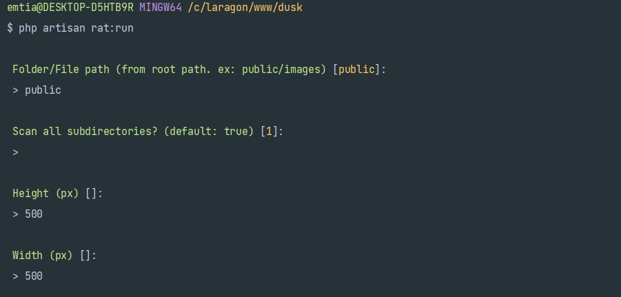
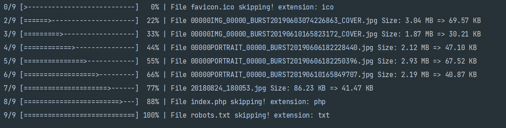

# Laravel Rat :rat:

[](https://packagist.org/packages/emtiazzahid/laravel-rat)
[](https://packagist.org/packages/emtiazzahid/laravel-rat)

Resize all of your images in certain folder by CLI 




## Installation

You can install the package via composer:

```bash
composer require emtiazzahid/laravel-rat
```

## Usage

```bash
php artisan rat:run
```

### Testing

```bash
composer test
```

### Changelog

Please see [CHANGELOG](CHANGELOG.md) for more information what has changed recently.

## Contributing

Please see [CONTRIBUTING](CONTRIBUTING.md) for details.

### Security

If you discover any security related issues, please email emtiazzahid@gmail.com instead of using the issue tracker.

## License

The MIT License (MIT). Please see [License File](LICENSE.md) for more information.

## TODO

- Image optimization
- Undo action
- Image resize with model iteration
